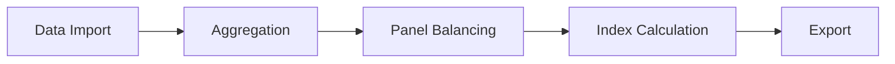

# Workflow Overview

PyIndexGUI enforces a strict, sequential data pipeline. Each tab consumes the output of the previous one, so you generally work left-to-right:

| Step | Tab | Purpose |
|------|-----|---------|
| 1 | [Data Import](data-import.md) | Load a file, map columns, standardize types. |
| 2 | [Aggregation](aggregation.md) | Collapse observations into regular time periods. |
| 3 | [Panel Balancing](panel-balancing.md) | Build a complete, balanced product-period panel. |
| 4 | [Index Calculation](index-calculation.md) | Compute bilateral and/or multilateral indices. |
| 5 | [Export](export.md) | Save results to CSV or Excel. |

## Tab navigation & prerequisites

Tabs are gated: you cannot move to a later stage until its predecessor has produced output. For example:

- You cannot **Aggregate** until columns have been **standardized**.
- You cannot compute **Indices** until the panel has been **balanced**.
- You cannot **Export** until at least one index has been calculated.

If you re-run an earlier step (e.g. re-standardize with a different mapping), all downstream results are automatically **invalidated** and you must repeat the affected steps.

!!! note "The Info tab is always available"
    The **Info** tab has no prerequisites — you can open it at any time, even on a fresh launch with no data loaded.
